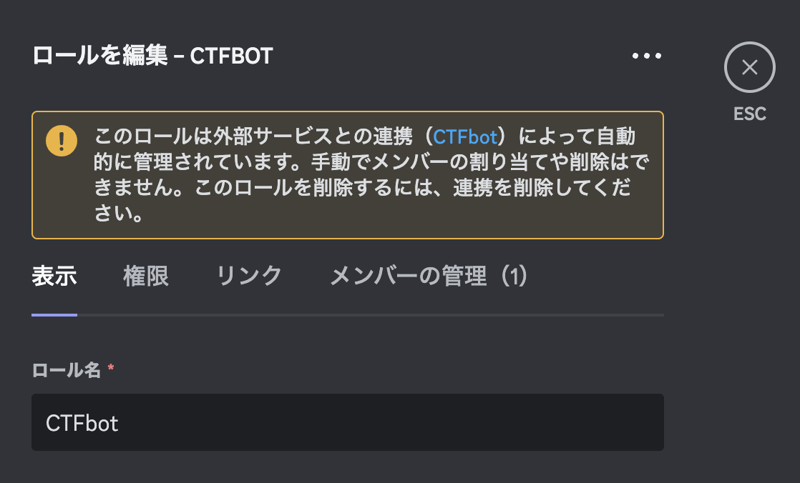
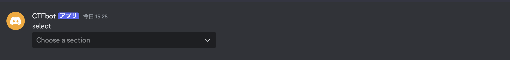
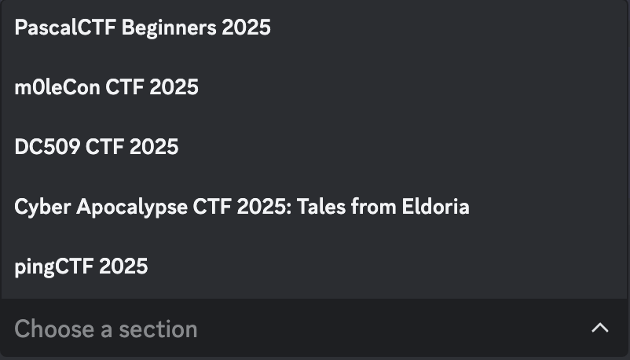
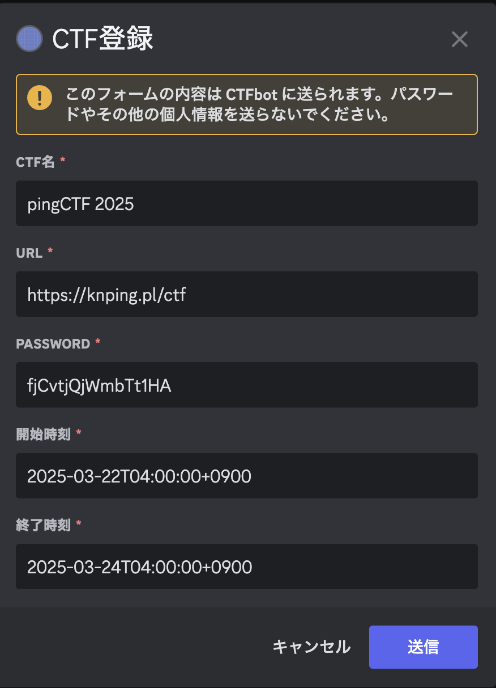
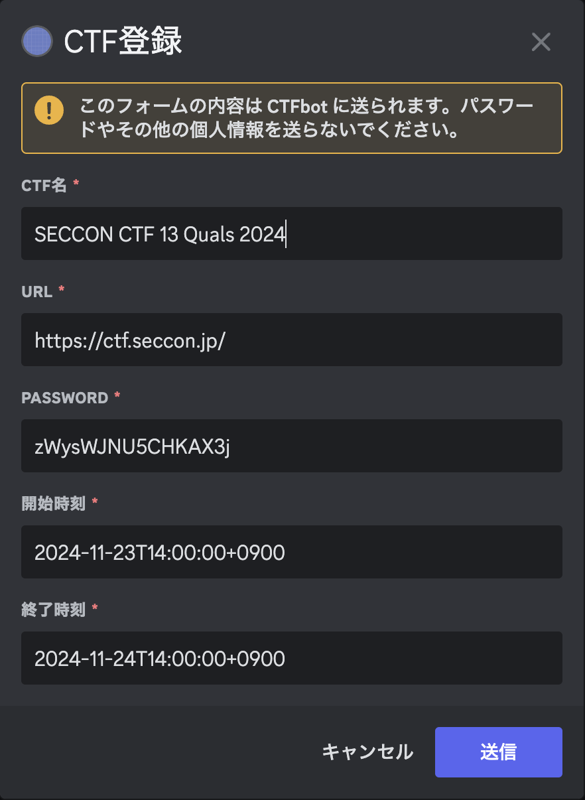

# Discord bot

- [Discord bot](#discord-bot)
  - [Botの作り方](#botの作り方)
  - [.env](#env)
  - [/get\_event](#get_event)
    - [event登録](#event登録)
    - [event参加](#event参加)
  - [/set\_event ](#set_event-)
    - [id指定する方法](#id指定する方法)
    - [id指定しない方法](#id指定しない方法)

## Botの作り方

[createBot.md](./createBot.md)を参照してください。

## .env

`.env`の解説をします。

まず、`.env`の配置は、README.mdと同じ階層です。

`.env`に記載するべき項目は、以下です。

- TOKEN: [createBot.md](./createBot.md)を参照してください。
- BOT_ROLE: 以下を参照ください。
- PASSWORD_LENGTH: event登録時、自動でパスワードが作成されますが、そのパスワードの長さを指定できます。
- CHANNEL_URL: 以下を参照ください。

BOT_ROLEは、以下であればCTFBotと入れてください。



**CHANNEL_URL**

Botが発言を行うためのチャンネルです。

このURLは、Botに発言をしてほしいチャンネルに対して、以下の手順を踏むことで取得可能です。

「右クリック>リンクをコピー」

```text
TOKEN=
BOT_ROLE=
PASSWORD_LENGTH=
CHANNEL_URL=
```

## 特徴

- コマンドは任意の箇所から呼び出し可能です。
  - ただし、CTFイベント登録後の「registered XXX CTF」というメッセージは、`.env`で設定した`CHANNEL_URL`に流れるようになっています。
- 基本的にCTFBotが発言する内容は、サイレントです。（通知がいかないようになっています。）
- 操作でのエラーなど、全体が見る必要のないメッセージは、操作を実行したユーザのみが閲覧できるようにしてあります。
  - また、「registered XXX CTF」といった消してはいけないメッセージ以外は適当な秒数で自動的に削除されます。
    - これにより、チャンネルが荒れることを防ぎます。

## /get_event

### event登録
直近で開催されるCTF Eventを5つ取得し、表示してくれます。
(現在開催中のCTFは含みません。)





いずれかを選択すると、以下のように情報が出ます。



「送信」を押下すると、private categoryが作成されます。


### event参加

CTF 参加者は、Botが発言した「registered xxxCTF」のメッセージに対して何らかのリアクションを押すと、Botがカテゴリへの参加権を与えてくれます。

## /set_event <id>

`/set_event`は任意のeventを設定可能なコマンドです。

### id指定する方法

例えば、`SECCON CTF 13 Quals`は、CTFTimeのURLは`https://ctftime.org/event/2478`です。
この時、`2478`がidとなります。


このように入力すると、CTFTimeからいい感じに情報を取得してくれます。



### id指定しない方法

`/set_event`を入力するだけです。
以下のような画面出ます。


CTF Timeに登録されていないやつを登録するために存在しています。

## Note: Azure VM でのデプロイ

``` bash
sudo apt update && sudo apt upgrade -y
sudo apt install python3.11 python3-pip -y

sudo su
mkdir -p ~/CTFBot

echo 'export TOKEN=XXX' >> ~/.bashrc
echo 'export BOT_ROLE=CTFBot' >> ~/.bashrc
echo 'export PASSWORD_LENGTH=16' >> ~/.bashrc
echo 'export CHANNEL_URL=https://discord.com/channels/XXX/XXX' >> ~/.bashrc
source ~/.bashrc

cd /root/CTFBot
wget https://raw.githubusercontent.com/kash1064/CTFBot/refs/heads/main/src/bot.py
wget https://raw.githubusercontent.com/kash1064/CTFBot/refs/heads/main/src/requirements.txt
pip3 install -r requirements.txt
python3 bot.py

history -c
```
