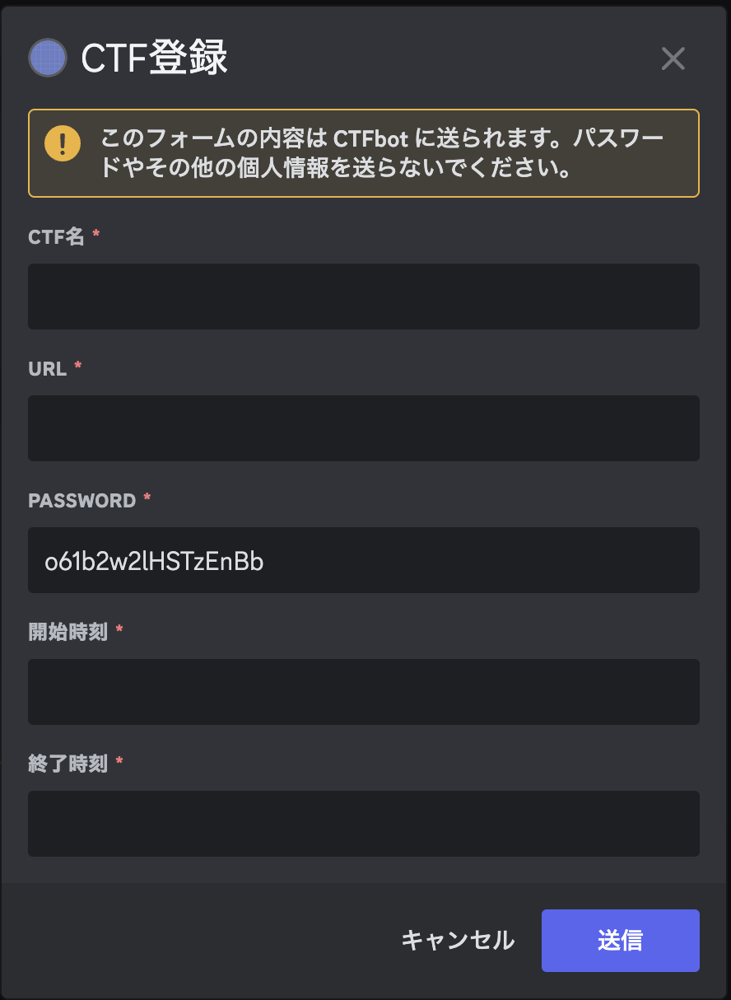

# Discord bot

- [Discord bot](#discord-bot)
  - [Botの作り方](#botの作り方)
  - [.env](#env)
  - [/get\_event](#get_event)
    - [event登録](#event登録)
    - [event参加](#event参加)
  - [/set\_event ](#set_event-)
    - [id指定する方法](#id指定する方法)
    - [id指定しない方法](#id指定しない方法)

## Botの作り方

[createBot.md](./createBot.md)を参照してください。

## .env

README.mdと同じ階層に、.envを配置してください。

TOKENは、createBot.mdで言及されているように記述をしてください。
BOT_ROLEは、以下であればCTFBotと入れてください。


```text
TOKEN=
BOT_ROLE=
```

## /get_event

### event登録
直近で開催されるCTF Eventを5つ取得し、表示してくれます。
(現在開催中のCTFは含みません。)


いずれかを選択すると、以下のように情報が出ます。


「送信」を押下すると、private categoryが作成されます。


### event参加

CTF 参加者は、Botが発言した「registered xxxCTF」のメッセージに対して何らかのリアクションを押すと、Botがカテゴリへの参加権を与えてくれます。

## /set_event <id>

`/set_event`は任意のeventを設定可能なコマンドです。

### id指定する方法

例えば、`SECCON CTF 13 Quals`は、CTFTimeのURLは`https://ctftime.org/event/2478`です。
この時、`2478`がidとなります。


このように入力すると、CTFTimeからいい感じに情報を取得してくれます。


### id指定しない方法

`/set_event`を入力するだけです。
以下のような画面出ます。



CTF Timeに登録されていないやつを登録するために存在しています。
