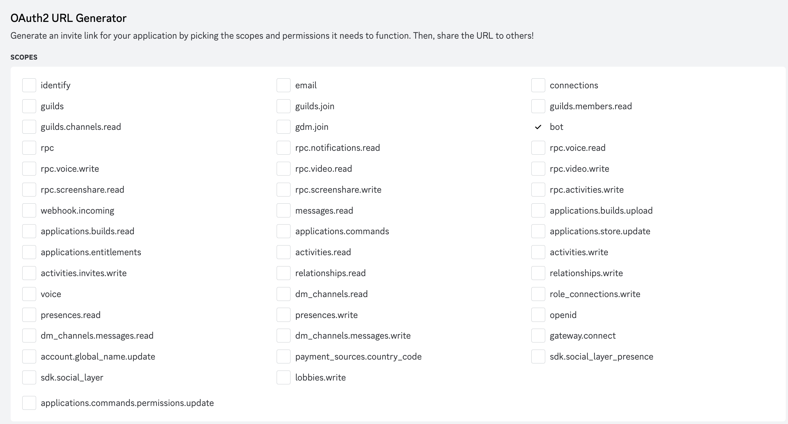
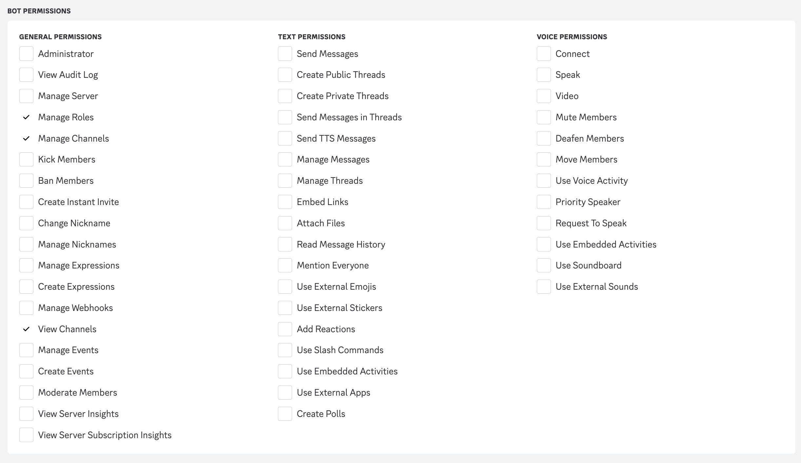
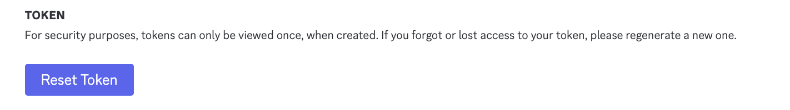
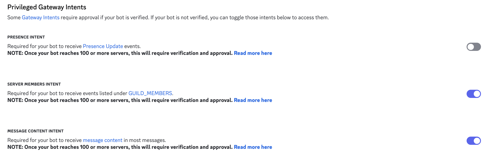

# Discord Botの作り方

1. developers portalにアクセス。
https://discord.com/developers/applications

2. New Application > CreateでBotを作る。
3. OAuth2 > SCOPESでbotを選択

4. Bot PERMISSIONSで、`Manage Roles`, `Manage Channels`, `View Channels`を選択。

5. Generated URLにアクセスを行い、自身のサーバにBotを入れてあげる。
6. Bot画面に移動
7. TOKENを取得し、.envに`TOKEN=<値>`と書き込む (.envの位置は、README.mdと同じ階層)

8. Privileged Gateway Intent部分の以下の箇所にチェックを入れる。
      - Server Members Intent
      - Message Content Intent

